# hit-thesis-template-word
Harbin Institute of Technology (HIT) undergraduate thesis Word template | updated continuously

## 使用前置
- 文献管理采用Zotero，请预先熟悉使用Zotero以方便参考文献的添加。
- 在Zotero中工具栏中选择【编辑】——【首选项】——【引用】——【样式】——【+】，在弹出的选择窗口中选择style文件夹中的文件 `china-national-standard-gb-t-7714-2015-numeric-etal-nodoi-fullwidth-nonumber.csl`，如果弹出弹窗，选择【OK】即可。

## 使用方法说明
- 文档模板位于“~/templates/.dotx”，将文件直接复制到“文档/自定义 Office 模板”中（或者一般位于“C:\Users\Administrator\Documents\自定义 Office 模板”）。
- 使用时，新建word文档，工具栏选择【文件】——【新建】——【个人】，在其中找到添加的模板，点击即可打开对应的模板。将其保存到需要存放的位置，编辑即可。

## 模板特点
- 方便的图表自动编号以及交叉引用，不需要因为中途插入图表而烦恼重新编号问题；
- 方便的一键目录生成，不用为格式发愁；
- 图表中方便的续图、续表的序号解决方案；
- 因学校要求的参考文献中的序号[x],中“[]”需要为全角，以及修改为全角后的悬挂缩进问题解决；

## 尚有缺陷部分
- 公式的编号问题，有以下几种解决方案，但是个人不太满意；
1. 利用Mathtype进行编号，需要自己添加章节符，较为麻烦；
2. 利用word无线框表格编号，需要手动编号，自动编号问题尚未解决；
3. 直接手敲编号，并用输入空格的方式控制公式位置，暴力方法，工作量较大。

## 引用格式文件说明
- 文件 `china-national-standard-gb-t-7714-2015-numeric-etal-nodoi-fullwidth-nonumber.csl` 基于 [eduyob/chinese-gbt7714-2015-numeric-etal-nodoi.csl](https://gitee.com/eduyob/citation-styles) 修改，遵循 [CC BY-SA 4.0](https://creativecommons.org/licenses/by-sa/4.0/) 协议。
- 修改内容：将文献引用(Bibliography)的序号去掉。

# 哈尔滨工业大学本科毕业论文 Word 模板

 
 


​**持续更新维护 | 适配学校格式规范 | 自动化排版解决方案**​

---

## 🌟 项目亮点

### 一键式排版功能
- 📊 图表自动编号与交叉引用  
- 📑 标准化目录自动生成  
- 📚 Zotero 深度整合的文献管理  
- 🔄 续图/续表智能编号系统  

### 格式规范保障
```text
✔️ 页边距：上3cm 下2.5cm 左3cm 右2.5cm  
✔️ 正文格式：宋体小四，1.5倍行距  
✔️ 页眉页脚：自动同步章节标题
```

---

## 🚀 快速入门

### 准备工作
1. 下载安装 [Zotero](https://www.zotero.org/)
2. 导入文献样式：
   ```diff
   Zotero > 编辑 > 首选项 > 引用 > 样式 > +
   选择项目内 styles/ 目录下的：
   + china-national-standard-gb-t-7714-2015-numeric-etal-nodoi-fullwidth-nonumber.csl
   ```

### 模板安装
```bash
# Windows 用户
copy .\templates\hit-thesis-template.dotx "%USERPROFILE%\Documents\自定义 Office 模板\"

# macOS 用户
cp -r ./templates/hit-thesis-template.dotx ~/Library/Group\ Containers/UBF8T346G9.Office/User\ Content/Templates/
```

### 创建新文档

```mermaid
graph LR
    A[打开 Word] --> B{新建文档}
    B -->|个人模板| C[HIT Thesis Template]
    C --> D[保存为 .docx]
    D --> E[开始写作]
```


---

## 🛠️ 已知限制与解决方案

| 功能         | 临时解决方案                          | 自动化计划         |
|--------------|-------------------------------------|-------------------|
| 公式自动编号 | 使用 MathType 手动设置章节编号       | 2023 Q4 开发      |
| 双语摘要排版 | 采用分节符手动控制换页               | 需求征集中        |
| 页眉章节同步 | 确保使用「标题1」样式                 | 已实现 ✅          |

---

## 👥 成为贡献者

### 您的参与让项目更好！
我们热烈欢迎以下类型的贡献：
- 🐛 反馈使用问题  
- 💡 提出改进建议  
- 🛠️ 提交代码优化  
- 📚 完善文档说明  

### 参与方式
```diff
+ 通过 Issue 报告问题：
   https://github.com/yourusername/hit-thesis-template-word/issues/new

+ 通过 Pull Request 提交改进：
   1. Fork 本仓库
   2. 创建功能分支 (git checkout -b feature/your-feature)
   3. 提交修改 (git commit -m 'Add awesome feature')
   4. 推送分支 (git push origin feature/your-feature)
   5. 创建 Pull Request
```

---

## 📜 协议声明
- 模板本体采用 [CC BY-SA 4.0](https://creativecommons.org/licenses/by-sa/4.0/) 协议  
- 文献样式文件改编自 [eduyob/chinese-gbt7714-2015-numeric-etal-nodoi.csl](https://gitee.com/eduyob/citation-styles)

[](https://star-history.com/#yourusername/hit-thesis-template-word&Date)
